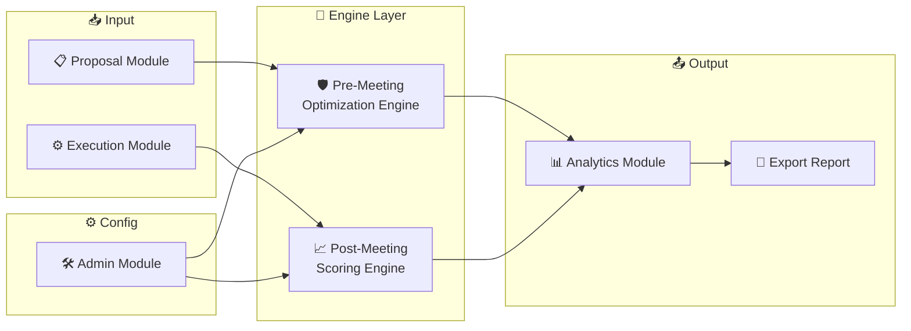
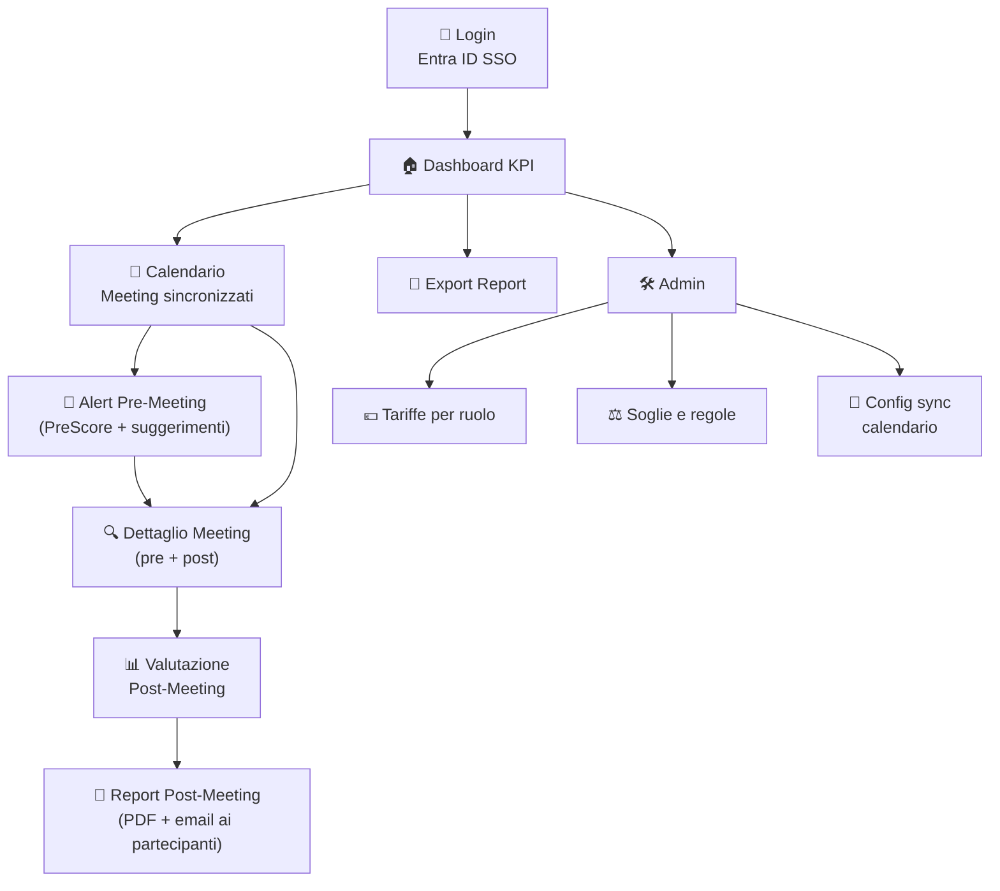
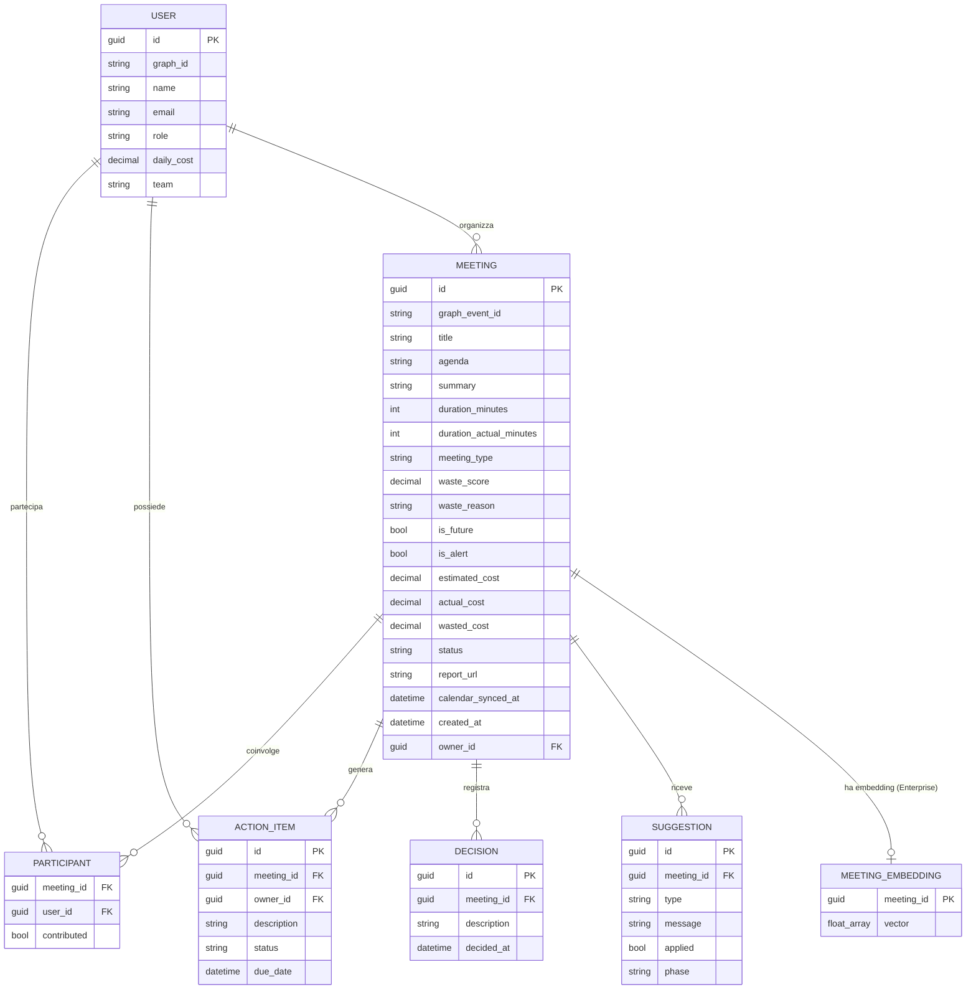
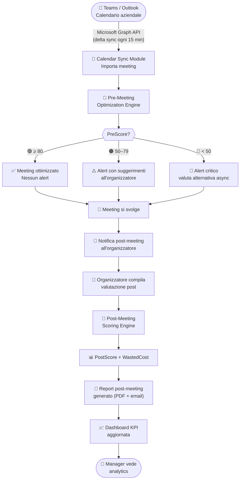
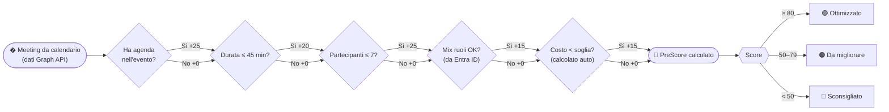
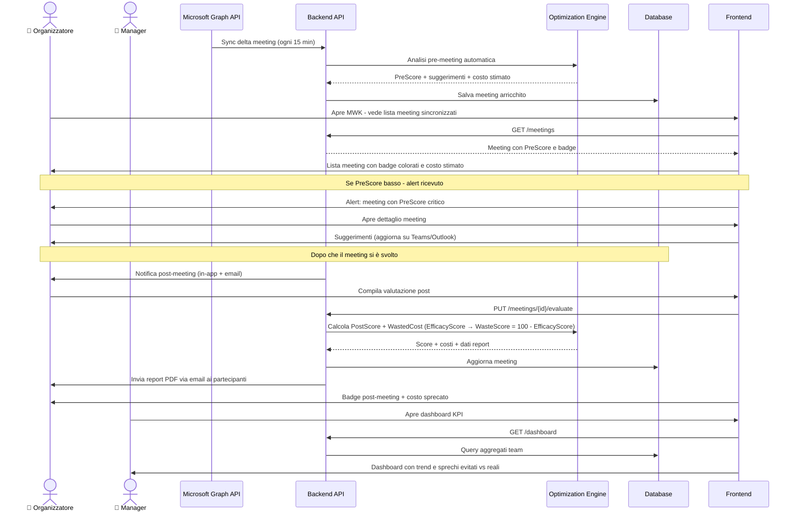

# 📘 DOCUMENTO DI ANALISI FUNZIONALE

# Meeting Waste Killer

### Piattaforma enterprise di **prevenzione e misurazione** dell'efficacia dei meeting aziendali

| Voce | Dettaglio |
|---|---|
| **Versione** | 1.1 |
| **Data** | Giugno 2026 |
| **Autore** | Team App in a Day |
| **Stato** | Approvato per PoC |
| **Classificazione** | Internal Use |

> **Nota:** Per i dettagli tecnici fare riferimento ai documenti collegati:
>
> - *Architettura Enterprise Finale*
> - *Architettura della PoC*
> - *Stima Costi Infrastruttura*
> - *Stima Giornate Uomo*
> - *Offerta Commerciale*

---

## 📑 Indice

1. Executive Summary
2. Contesto e razionale di business
3. Obiettivi e KPI di progetto
4. Scope (in/out)
5. Stakeholder e attori
6. Modello funzionale
7. Criteri di valutazione meeting (pre & post)
8. Casi d'uso dettagliati
9. Requisiti funzionali
10. Frontend design (UX/UI)
11. Modello dati
12. Flussi applicativi
13. Roadmap evolutiva
14. Glossario

---

# 1. 🎯 Executive Summary

**Meeting Waste Killer (MWK)** è una piattaforma SaaS enterprise progettata per **ridurre drasticamente il tempo e i costi sprecati in meeting aziendali**, agendo su due livelli complementari:

- 🛡 **Prevenzione (pre-meeting)** → analisi automatica dei meeting **già schedulati su Teams/Outlook**, con suggerimenti per ottimizzarli prima che avvengano
- 📊 **Misurazione (post-meeting)** → tracciamento di costo reale, qualità decisionale e report finale distribuibile al team

### 💡 Valore unico

MWK non richiede nessun inserimento manuale: si connette al calendario aziendale via **Microsoft Graph API** e analizza automaticamente ogni meeting schedulato, in funzione di:

- presenza e qualità dell'agenda (da descrizione evento calendario)
- composizione e numero dei partecipanti (da invitati Teams/Outlook)
- ruoli e seniority coinvolti (da directory Entra ID)
- durata pianificata
- costo stimato (calcolato automaticamente)

### 📈 Impatto atteso su azienda da 500 dipendenti

| Metrica | Valore |
|---|---|
| Risparmio annuo stimato | ~500.000 € |
| Payback | < 5 mesi |
| Riduzione meeting inefficaci | 25–40% |

---

# 2. 📊 Contesto e razionale di business

## 2.1 Il problema

| Dato | Valore |
|---|---|
| Tempo medio in meeting | 23% delle ore lavorative |
| % meeting giudicati improduttivi | ~40% |
| Costo nascosto per azienda 500 dip. | > 1,2 M€/anno |
| % decisioni effettive nei meeting | < 50% |

## 2.2 Cause principali

- Agende assenti o generiche
- Troppi partecipanti non necessari
- Durata sovrastimata
- Mancanza di owner e action item
- Meeting che potevano essere mail/chat

## 2.3 Opportunità di mercato

- Nicchia **Meeting Intelligence** in forte crescita
- Mercato SaaS B2B ricettivo a verticali di produttività
- Bassa competizione su soluzioni "preventive" (vedi §2.4)

## 2.4 🆚 Competitive Positioning

| Feature | **MWK** | Fellow.app | Clockwise | MS Viva Insights | Geekbot |
|---|:---:|:---:|:---:|:---:|:---:|
| Pre-meeting prevention engine | ✅ | ❌ | ❌ | ❌ | ❌ |
| Costo meeting in tempo reale (€) | ✅ | ❌ | ❌ | ⚠️ | ❌ |
| Post-meeting scoring (5 criteri) | ✅ | ✅ | ❌ | ⚠️ | ❌ |
| Dual-engine pre + post | ✅ | ❌ | ❌ | ❌ | ❌ |
| Suggerimenti alternativi (async) | ✅ | ❌ | ⚠️ | ❌ | ❌ |
| Integrazione Entra ID / ADO | ✅ | ❌ | ❌ | ✅ | ❌ |
| GDPR + private cloud | ✅ | ❌ | ❌ | ✅ | ❌ |
| Dashboard sprechi evitati vs reali | ✅ | ❌ | ❌ | ⚠️ | ❌ |

> **Posizionamento chiave:** MWK è l'unica soluzione che agisce **prima** che il meeting avvenga, prevenendo lo spreco anziché solo misurarlo. È nativa Microsoft stack, GDPR-ready e progettata per enterprise europeo.

---

# 3. 🎯 Obiettivi e KPI di progetto

## 3.1 Obiettivi di business

1. Ridurre il numero di meeting inefficaci di **almeno il 25%** entro 6 mesi
2. Rendere visibile e misurabile il **costo dei meeting**
3. Promuovere una **cultura del meeting efficace** (data-driven)
4. Generare **ROI dimostrabile** sotto i 12 mesi

## 3.2 KPI principali

| KPI | Target |
|---|---|
| % meeting con score post > 70 | ≥ 70% |
| % meeting prevenuti da analisi pre | ≥ 15% |
| Costo medio meeting | -20% YoY |
| % meeting con agenda compilata | ≥ 90% |
| % meeting con decisione + action item | ≥ 80% |
| Adoption rate utenti | ≥ 75% |

---

# 4. 🧭 Scope

## ✅ In scope (versione Enterprise)

- **Sincronizzazione automatica meeting da Teams/Outlook** (Microsoft Graph API)
- Analisi pre-meeting automatica con suggerimenti
- Calcolo costo previsto e reale (da ruoli directory Entra ID)
- Scoring post-meeting (qualità decisionale)
- **Report post-meeting** generato automaticamente (PDF/email)
- Dashboard manageriali e KPI
- Integrazione SSO (Entra ID)
- Export report aggregato (PDF/Excel)
- Multi-ruolo (User / Manager / Admin)

## ✅ In scope (versione PoC – 4h)

- Lettura meeting da **dataset seed statico** (simulazione calendar sync, nessun inserimento manuale)
- **WasteScore hardcodato** nel seed (nessun calcolo algoritmico, no engine)
- **Autenticazione JWT mock** con utenti hardcodati (no Entra ID)
- **4 endpoint read-only**: `POST /auth/login`, `GET /meetings`, `GET /meetings/{id}`, `GET /dashboard`
- Dashboard KPI base (spreco totale, avg score, % meeting sotto soglia, alert count)
- Lista meeting con badge WasteScore e filtri (`isFuture`, `onlyAlerts`)
- Dettaglio meeting con partecipanti, allegati con URL mock e `estimatedCost` calcolato

## ❌ Out of scope (v1)

- Multi-tenant
- Mobile app nativa
- AI generativa per agenda (v1.5)
- Integrazioni Google Workspace
- Reportistica predittiva
- Trascrizione automatica meeting (v1.5)

---

# 5. 👥 Stakeholder e attori

## 5.1 Stakeholder

| Stakeholder | Interesse |
|---|---|
| Top Management | ROI, riduzione costi |
| HR / People Ops | Cultura aziendale, engagement |
| Project Manager | Efficacia operativa |
| IT | Sicurezza, integrazione, scalabilità |
| Dipendenti | Riduzione meeting inutili |

## 5.2 Attori applicativi

| Attore | Responsabilità |
|---|---|
| **Dipendente** | Partecipa ai meeting, visualizza la pre-analisi automatica e compila la valutazione post |
| **Manager** | Consulta KPI di team, vede sprechi e trend |
| **Admin** | Configura ruoli, costi orari, soglie, regole |
| **Microsoft Graph API** | Sincronizza meeting da Teams/Outlook |
| **Sistema (Engine)** | Esegue analisi pre/post automatiche e genera report |

## 5.3 👤 User Personas

### Persona 1 — Marco Rossi · Project Manager

> *"Organizzo 10 meeting a settimana. Metà finisce senza decisioni e la settimana dopo rifacciamo la stessa call."*

| | |
|---|---|
| **Età** | 34 anni |
| **Ruolo** | Project Manager, software house 200 dip. |
| **Frequenza meeting** | 8–10/settimana (organizzatore) |
| **Pain principale** | Meeting senza agenda, senza decisioni, ripetuti |
| **Goal** | Ridurre il carico di meeting, più tempo per lavoro profondo |
| **Come usa MWK** | Apre MWK e trova già la pre-analisi automatica di tutti i suoi meeting calendario; riceve alert su quelli critici |

### Persona 2 — Chiara Ferrari · Head of Engineering

> *"Il mio team è sempre in meeting. Non riusciamo a shipparle le cose perché siamo in call tutto il giorno."*

| | |
|---|---|
| **Età** | 42 anni |
| **Ruolo** | Head of Engineering, 15 riporti diretti |
| **Frequenza meeting** | 6/settimana (partecipante + osservatrice) |
| **Pain principale** | Produttività del team azzerata dal meeting overhead |
| **Goal** | Visibilità sul costo settimanale; ridurre il "meeting tax" |
| **Come usa MWK** | Dashboard manager: costo aggregato per team, top meeting costosi, trend settimanale; riceve report post-meeting automatici |

### Persona 3 — Luca Bianchi · Senior Developer

> *"Vengo invitato a meeting in cui non serve la mia presenza. Perdo il focus e poi lavoro la sera per recuperare."*

| | |
|---|---|
| **Età** | 27 anni |
| **Ruolo** | Senior Developer |
| **Frequenza meeting** | 4–5/settimana (partecipante passivo) |
| **Pain principale** | Inviti irrilevanti, interruzione del deep work |
| **Goal** | Partecipare solo dove serve; feedback visibile sull'utilità |
| **Come usa MWK** | Vede il PreScore automatico del meeting prima che si svolga; compila la valutazione post in 30 secondi e riceve il report via email |

---

# 6. 🧩 Modello funzionale

## 6.1 Macro-aree funzionali



## 6.2 Moduli applicativi

| # | Modulo | Descrizione |
|---|---|---|
| 1 | **Calendar Sync Module** | Sincronizzazione automatica meeting da Teams/Outlook via Microsoft Graph API |
| 2 | **Pre-Meeting Optimization Engine** | Analisi predittiva automatica su dati calendario; rule-based (v1) / AI (v1.5) |
| 3 | **Post-Meeting Assessment Module** | Raccolta esito meeting (decisioni, action item, durata reale) |
| 4 | **Post-Meeting Scoring Engine** | Valutazione su 5 criteri + generazione report finale |
| 5 | **Analytics Module** | Dashboard, KPI, alert, trend |
| 6 | **Admin Module** | Configurazione tariffe, soglie, regole engine |

---

# 7. 📏 Criteri di valutazione meeting

## 7.1 Criteri POST-meeting

| # | Criterio | Peso |
|---|---|---|
| 1 | Obiettivo chiaro (agenda presente) | 20 |
| 2 | Decisione presa | 30 |
| 3 | Action item generati | 20 |
| 4 | Partecipanti necessari | 15 |
| 5 | Durata coerente con il piano | 15 |

**Formula:**

```
EfficacyScore (PostScore) = Σ (criterioValidato × peso)    Range: 0–100
WasteScore                = 100 - EfficacyScore             Range: 0–100 (alto = più spreco)
Cost                      = SUM(DailyCost_partecipante / 8 × (DurationMinutes / 60))
WastedCost                = Cost × (WasteScore / 100)
```

> **Nota:** `WasteScore` è il valore persistito in DB e mostrato in UI (coerente con le architetture PoC ed Enterprise). Un valore alto indica **maggiore spreco**; è la metrica su cui si basa `IsAlert` (soglia 60). In Enterprise, `WasteScore` è calcolato direttamente da Azure AI Foundry invece che con la formula rule-based.

| WasteScore | EfficacyScore | Etichetta |
|---|---|---|
| 0–39 | 61–100 | 🟢 Meeting utile |
| 40–69 | 31–60 | 🟠 Spreco medio |
| 70–100 | 0–30 | 🔴 Alto spreco (IsAlert se > 60) |

## 7.2 Criteri PRE-meeting

| # | Criterio | Peso |
|---|---|---|
| 1 | Presenza agenda | 25 |
| 2 | Coerenza durata vs tipologia | 20 |
| 3 | Rilevanza partecipanti | 25 |
| 4 | Mix ruoli adeguato | 15 |
| 5 | Cost efficiency | 15 |

**Formula:**

```
PreMeetingScore = Σ (criterioValidato × peso)    Range: 0–100
```

| Score | Etichetta | Azione |
|---|---|---|
| 80–100 | 🟢 Ottimizzato | Procedi |
| 50–79 | 🟠 Da migliorare | Mostra suggerimenti |
| 0–49 | 🔴 Sconsigliato | Proponi alternativa async |

## 7.3 Regole di ottimizzazione

| Condizione rilevata | Suggerimento |
|---|---|
| Nessuna agenda | "Aggiungi un'agenda prima di convocare" |
| Durata > 60 min | "Riduci a 45 min o splitta in due sessioni" |
| > 7 partecipanti | "Riduci o rendi il meeting informativo" |
| C-level senza decision point | "Valuta se la presenza è necessaria" |
| Solo operativi su tema strategico | "Aggiungi un decision maker" |
| Topic ripetuto in < 7 giorni | "Valuta follow-up async" |
| Costo > soglia configurata | "Considera un'alternativa" |

## 7.4 Tabella costi orari (configurabile da Admin)

| Ruolo | €/h (default) | DailyCost (8h, default) |
|---|---|---|
| Junior | 30 | 240 |
| Mid | 50 | 400 |
| Senior | 75 | 600 |
| Manager | 100 | 800 |
| Director | 150 | 1.200 |
| C-Level | 250 | 2.000 |

> **Nota:** Il sistema persiste `DailyCost` (costo giornaliero, 8h) per utente — coerente con il modello dati delle architetture PoC ed Enterprise. Il costo orario si ricava come `DailyCost / 8`.

---

# 8. 📋 Casi d'uso dettagliati

### UC01 – Sincronizzazione automatica calendario

| | |
|---|---|
| **Attore** | Sistema (Microsoft Graph API) |
| **Trigger** | Accesso utente / schedulazione periodica (ogni 15 min) |
| **Flusso** | 1. Sistema si autentica con Graph API tramite token Entra ID · 2. Legge eventi calendario dei prossimi 7 giorni (e ultimi 30 giorni) · 3. Importa titolo, agenda, partecipanti, durata, tipologia · 4. Risolve ruoli partecipanti da directory Entra ID · 5. Salva/aggiorna meeting su DB MWK |
| **Post-condizione** | Meeting sincronizzati disponibili in MWK con dati calendario |

### UC02 – Analisi pre-meeting automatica

| | |
|---|---|
| **Attore** | Sistema (Optimization Engine) |
| **Trigger** | Nuovo meeting sincronizzato / modifica evento calendario |
| **Flusso** | Sistema esegue automaticamente il Pre-Meeting Engine su ogni meeting importato → calcola PreScore, etichetta, costo stimato, lista suggerimenti |
| **Post-condizione** | Meeting arricchito con PreScore e suggerimenti visibili in app |

### UC03 – Visualizzazione e gestione suggerimenti pre-meeting

| | |
|---|---|
| **Attore** | Dipendente (organizzatore) |
| **Pre-condizione** | Meeting sincronizzato con PreScore calcolato |
| **Flusso** | 1. Utente apre il meeting in MWK · 2. Vede PreScore, badge, costo stimato, suggerimenti · 3. Può agire direttamente su Teams/Outlook per modificare (ridurre partecipanti, aggiungere agenda) · 4. Al prossimo sync il PreScore si aggiorna automaticamente |
| **Post-condizione** | Organizzatore informato e in grado di ottimizzare prima del meeting |

### UC04 – Valutazione post-meeting

| | |
|---|---|
| **Attore** | Dipendente (organizzatore) |
| **Trigger** | Meeting terminato (data/ora superata) |
| **Flusso** | 1. Sistema notifica l'organizzatore (alert in-app / email) · 2. Utente compila: decisione presa (sì/no + testo), action item con owner e scadenza, durata effettiva, partecipanti che hanno contribuito · 3. Sistema calcola PostScore + WastedCost |
| **Post-condizione** | Meeting valutato con PostScore, badge e costo sprecato |

### UC05 – Generazione report post-meeting

| | |
|---|---|
| **Attore** | Sistema |
| **Trigger** | Completamento valutazione post-meeting |
| **Flusso** | 1. Sistema genera report strutturato con: riepilogo meeting, PreScore vs PostScore, decisioni prese, action item con owner, costo reale e WastedCost · 2. Report disponibile in PDF nella scheda meeting · 3. Invio automatico via email ai partecipanti |
| **Post-condizione** | Report distribuito ai partecipanti; tracciabilità completa |

### UC06 – Dashboard KPI (Manager)

| | |
|---|---|
| **Attore** | Manager |
| **Contenuto** | € sprecati post · € evitati pre · % meeting inutili · Top 3 meeting costosi · Trend qualità decisionale settimanale |

### UC07 – Export report aggregato

| | |
|---|---|
| **Attore** | Manager / Admin |
| **Formati** | PDF, Excel |
| **Contenuto** | KPI aggregati, lista meeting con score, costi, trend periodo selezionato |

### UC08 – Configurazione Admin

| | |
|---|---|
| **Attore** | Admin |
| **Configurabile** | Tariffe orarie per ruolo · Soglie di costo · Regole engine · Frequenza sync calendario |

---

# 9. ⚙️ Requisiti funzionali

| ID | Requisito |
|---|---|
| RF01 | Sincronizzazione automatica meeting da Teams/Outlook tramite Microsoft Graph API (delta sync ogni 15 min) |
| RF02 | Analisi pre-meeting automatica su ogni meeting sincronizzato (agenda, partecipanti, durata, ruoli da Entra ID) |
| RF03 | Calcolo costo previsto basato su ruoli partecipanti (risolti da directory Entra ID) |
| RF04 | Scoring post-meeting su 5 criteri (compilazione da parte dell'organizzatore) |
| RF05 | Calcolo costo reale + WastedCost a completamento valutazione |
| RF06 | Dashboard KPI aggregati (pre + post) per utente e per team |
| RF07 | Filtri per periodo, team, owner, score, stato (futuro/passato/valutato) |
| RF08 | Etichettatura automatica (🟢 🟠 🔴) su PreScore e PostScore |
| RF09 | Alert e suggerimenti per meeting con PreScore < 50 (notifica organizzatore) |
| RF10 | Export report aggregato PDF / Excel |
| RF11 | Gestione ruoli utente (User / Manager / Admin) |
| RF12 | Configurazione tariffe orarie e regole engine da Admin |
| RF13 | Generazione report finale post-meeting (PDF) con decisioni, action item, score e costi; invio automatico via email ai partecipanti |

---

# 10. 🎨 Frontend Design (UX/UI)

## 10.1 Principi UX

- **Zero friction**: nessun inserimento manuale — i meeting arrivano automaticamente dal calendario
- **Chiarezza immediata**: 1 azione principale per schermata, score sempre visibile
- **Visual storytelling**: badge colorati, costi in €, trend grafici, alert proattivi
- **Mobile-first responsive**

## 10.2 Sitemap



## 10.3 Schermate principali

### 🏠 Dashboard

- KPI card: 💸 € sprecati · 🛡 € evitati · 📉 % meeting inutili
- Grafico trend settimanale
- Top 3 meeting più costosi
- Alert: meeting imminenti con PreScore basso

### 📅 Calendario meeting sincronizzati

- Vista lista dei meeting importati da Teams/Outlook (prossimi 7 giorni + storici)
- Ogni meeting mostra: titolo, data/ora, badge PreScore, costo stimato, partecipanti
- Filtri: periodo, team, owner, score, stato (futuro / da valutare / completato)
- Nessun inserimento manuale — tutto viene dal calendario aziendale

### 🔔 Alert pre-meeting

- Notifica in-app (e opz. email) per meeting imminenti con PreScore 🔴 < 50 o 🟠 < 80
- Mostra suggerimenti specifici: aggiungi agenda, riduci partecipanti, valuta async
- Link diretto a Teams/Outlook per modificare l'evento

### 🔍 Dettaglio meeting

- Riepilogo pre: PreScore, badge, costo stimato, suggerimenti applicati
- Riepilogo post (dopo valutazione): PostScore, WastedCost, decisioni, action item
- **Report post-meeting**: generazione PDF + invio email ai partecipanti

## 10.4 Design System

| Elemento | Valore |
|---|---|
| Tipografia | Inter |
| Verde | #16A34A |
| Arancio | #F59E0B |
| Rosso | #DC2626 |
| Primary | #2563EB |
| Componenti | shadcn/ui (Card, Badge, Dialog, Table, Chart) |
| Iconografia | Lucide |

---

# 11. 🗄 Modello dati



> **Note allineamento architetture:**
> - `graph_event_id` = `GraphEventId` dell'Enterprise arch (ID evento Outlook/Teams da Graph API)
> - `graph_id` su USER = OID Azure AD (Enterprise); assente in PoC
> - `waste_score` = metrica primaria persistita (alto = più spreco); in PoC hardcodato nel seed, in Enterprise calcolato da Azure AI Foundry
> - `daily_cost` su USER = costo giornaliero (8h); formula estimatedCost: `SUM(DailyCost/8 × (DurationMinutes/60))`
> - `MEETING_EMBEDDING` è entità Enterprise only (pgvector su PostgreSQL)
> - `ACTION_ITEM`, `DECISION`, `SUGGESTION` sono funzionalità Enterprise v1.0 (non presenti nel PoC read-only)

---

# 12. 🔄 Flussi applicativi

## 12.1 Flusso end-to-end



## 12.2 Flusso decisionale pre-meeting (Optimization Engine)



## 12.3 Flusso utente UX (sequence)



---

# 13. 🛣 Roadmap evolutiva

### v1.0 – MVP Enterprise *(in scope)*

- Sincronizzazione automatica meeting da Teams/Outlook (Microsoft Graph API)
- Pre-Meeting Engine rule-based con alert e suggerimenti automatici
- Post-Meeting Scoring + **report finale** (PDF + email ai partecipanti)
- Dashboard KPI (pre + post)
- SSO Entra ID + RBAC

### v1.5

- AI generativa: analisi semantica agenda e suggerimenti avanzati (Azure AI Foundry — estende il modello già usato in Enterprise v1.0)
- Trascrizione automatica meeting Teams + estrazione action item
- Mobile responsive avanzato (PWA)
- Integrazione ADO: action item creati automaticamente come Work Item

### v2.0

- AI predittiva: forecast sprechi futuri per team
- Coach virtuale meeting (suggerimenti real-time durante il meeting)
- Multi-tenant SaaS
- Marketplace di best practice aziendali

---

# 14. 📖 Glossario

| Termine | Definizione |
|---|---|
| **MWK** | Meeting Waste Killer |
| **WasteScore** | Punteggio di spreco (0–100, alto = più spreco). In PoC hardcodato nel seed; in Enterprise calcolato da Azure AI Foundry. Valore persistito in DB; `IsAlert` si attiva se `WasteScore > 60` |
| **EfficacyScore (PostScore)** | Punteggio di efficacia post-meeting (0–100, alto = più utile), derivato dai 5 criteri rule-based. Relazione: `WasteScore = 100 − EfficacyScore` |
| **PreScore** | Punteggio analisi preventiva pre-meeting (0–100). Segue la stessa scala di WasteScore (alto = meeting rischioso) |
| **WastedCost** | Costo economico associato all'inefficacia del meeting: `Cost × (WasteScore / 100)` |
| **Optimization Engine** | Modulo di analisi predittiva pre/post meeting |
| **Action Item** | Azione concreta con owner e scadenza uscita dal meeting |
| **Dual-Engine** | Approccio unico MWK: engine separati per pre e post meeting |

---

> 📌 *Documento di Analisi Funzionale v1.1 — Meeting Waste Killer*
> Per architettura tecnica, stime e offerta commerciale fare riferimento ai documenti dedicati.
